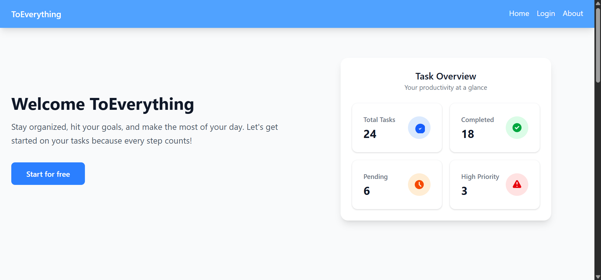
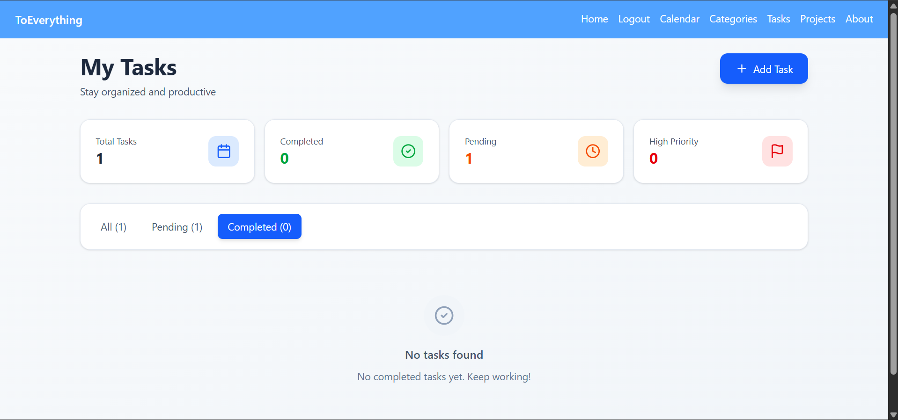
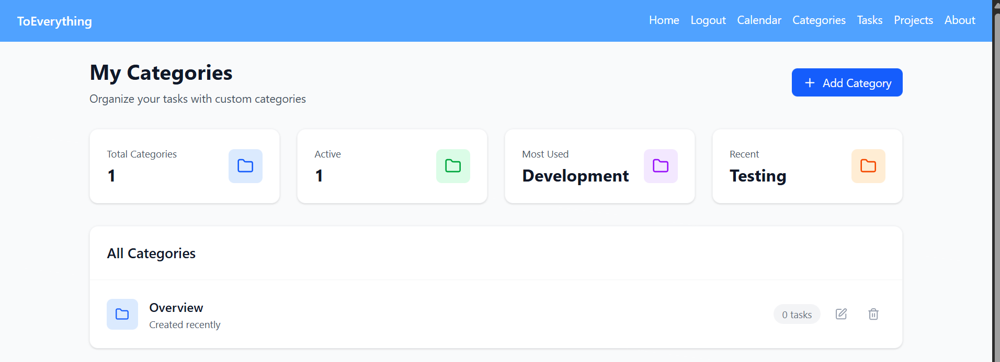
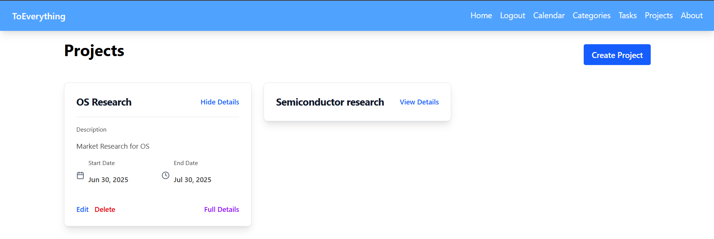

# ToEverything

A comprehensive todo application that helps you organize your tasks with projects, categories, and calendar integration. Built with modern web technologies and containerized for easy deployment.

## Screenshots
   
   ### Home Page
   
   
   ### Task Page
   

   ### Categories Page
   

   ### Projects Page
   


## Features

### Core Functionality
- **Project Management**: Create and organize projects to group related tasks
- **Category System**: Categorize tasks for better organization and filtering
- **Task Management**: Create, edit, delete, and track task completion
- **Task Bundling**: Bundle related tasks together across projects and categories
- **Calendar Integration**: View and manage tasks with calendar functionality
- **Responsive Design**: Works seamlessly across desktop and mobile devices

### Authentication & Security
- **JWT Authentication**: Secure user authentication using JSON Web Tokens
- **Local Storage**: Client-side token storage for session persistence
- **User Management**: Individual user accounts with data isolation

### Tech Stack

### Frontend
- **Framework**: React
- **Styling**: CSS Tailwind

### Backend
- **Framework**: Django (Python)
- **Database**: PostgreSQL (SQLite3 for development)
- **Authentication**: JWT (JSON Web Tokens)
- **Web Server**: Nginx (reverse proxy)

### Deployment
- **Containerization**: Docker
- **Database**: PostgreSQL container

## Getting Started

### Prerequisites
- Docker and Docker Compose installed on your system
- Git for cloning the repository

### Installation

1. **Clone the repository**
   ```bash
   git clone <repository-url>
   cd ToEverything
   ```

2. **Run the application**
   ```bash
   # Start all services (builds automatically on first run)
   docker-compose up

   # Run in detached mode (background)
   docker-compose up -d
   ```

3. **Access the application**
   Open your browser and navigate to `http://localhost:3000`

### Development Setup

For local development without Docker:

1. **Install dependencies**
   ```bash
   npm install
   ```

2. **Start PostgreSQL database**
   Make sure PostgreSQL is running locally or use Docker for just the database:
   ```bash
   docker run --name toeverything-db -e POSTGRES_PASSWORD=yourpassword -p 5432:5432 -d postgres
   ```

3. **Run the application**
   ```bash
   # Development mode
   npm run dev

   # Production mode
   npm start
   ```

## Usage

### Getting Started
1. **Sign Up**: Create a new account or log in with existing credentials
2. **Create Projects**: Organize your work into projects
3. **Add Categories**: Create categories to classify your tasks
4. **Create Tasks**: Add tasks and assign them to projects and categories
5. **Bundle Tasks**: Group related tasks together for better organization
6. **Use Calendar**: View and manage tasks in calendar view

### Key Workflows
- **Project Organization**: Create projects for different areas of work or life
- **Task Categorization**: Use categories like "urgent", "work", "personal" for quick filtering
- **Calendar Planning**: Use the calendar view to schedule and visualize task deadlines
- **Task Bundling**: Bundle related tasks to tackle them as a group

## API Endpoints

### Authentication
- `POST /api/user/register/` - User registration
- `POST /api/user/login/` - User login
- `POST /api/user/logout/` - User logout

### Tasks
- `GET /api/tasks/list/` - Get all user tasks
- `POST /api/tasks/create/` - Create new task
- `GET /api/tasks/details/<int:id>/` - Get task details
- `PUT /api/tasks/update/<int:id>/` - Update task
- `DELETE /api/tasks/delete/<int:id>/` - Delete task
- `GET /api/tasks/calendar/` - Get tasks for calendar view

### Categories
- `GET /api/tasks/categories/` - Get all user categories
- `POST /api/tasks/category/create/` - Create new category
- `GET /api/tasks/category-details/<int:id>/` - Get category details
- `PUT /api/tasks/category/update/<int:id>/` - Update category
- `DELETE /api/tasks/category/delete/<int:id>/` - Delete category
- `GET /api/tasks/categories-list/` - Get categories list view

### Projects
- `GET /api/projects/list/` - Get all user projects
- `POST /api/projects/create/` - Create new project
- `GET /api/projects/details/<int:id>/` - Get project details
- `PUT /api/projects/update/<int:id>/` - Update project
- `DELETE /api/projects/delete/<int:id>/` - Delete project

## Docker Configuration

The application uses multi-container Docker setup:

### Services
- **App Container**: Runs the main application
- **Database Container**: PostgreSQL database
- **Volume Mounting**: Persistent data storage

### Docker Compose Structure
```yml
version: '3.8'
services:
  app:
    build: .
    ports:
      - "3000:3000"
    depends_on:
      - db
    environment:
      - NODE_ENV=production
  
  db:
    image: postgres:15
    environment:
      - POSTGRES_DB=toeverything
    volumes:
      - postgres_data:/var/lib/postgresql/data
```

## Contributing

1. Fork the repository
2. Create a feature branch (`git checkout -b feature/amazing-feature`)
3. Commit your changes (`git commit -m 'Add some amazing feature'`)
4. Push to the branch (`git push origin feature/amazing-feature`)
5. Open a Pull Request

## Roadmap

- [ ] Team collaboration features
- [ ] Advanced reporting and analytics
- [ ] Integration with external calendar services

---

**ToEverything** - Organize everything, accomplish anything.
